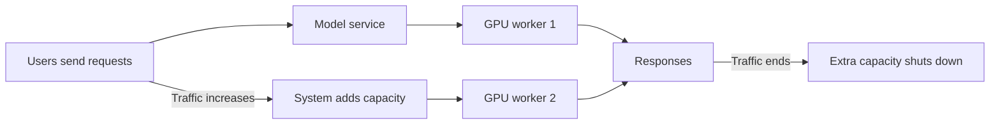

# Distributed vLLM inference platform

Serving-only GPU inference platform built with vLLM, Ray, Docker Compose,
Kubernetes, Prometheus, and KEDA. The scoped lab project is **complete** and
the final Vast.ai rental has been destroyed.

This repository contains no training, fine-tuning, dataset, gradient,
optimizer, or checkpoint-training code.

## What was proven

| Capability | Live evidence | Status |
|---|---|---|
| OpenAI-compatible streaming | Concurrent raw SSE validation with non-empty output and `data: [DONE]` | Proven |
| Single-GPU vLLM | 9B on RTX 3090; repository Compose path with 1.5B AWQ on RTX A4000 | Proven |
| Tensor parallelism | Qwen3.5-9B, TP=2, two RTX 3060 12 GiB GPUs | Proven |
| Ray execution | Same-host Ray placement group and two TP workers | Proven on one host |
| Kubernetes GPU serving | k3s, NVIDIA RuntimeClass/device plugin, probes, ClusterIP, PVC cache | Proven on one node |
| Prometheus observability | ServiceMonitor scrape, token counters, queue/KV/latency series | Proven |
| Horizontal autoscaling | KEDA Prometheus scaler, complete replicas, 1→2→1 | Proven |
| Load distribution | ClusterIP traffic split 55%/45%; aggregate throughput about doubled | Proven |
| Scale-to-zero | KEDA HTTP interceptor held one request through 0→1 and later returned 1→0 | Proven as a constrained lab gate |
| Safe teardown | Tunnels, k3s, Compose, GPU processes, and rental stopped in order | Proven |

The final accepted tag is
`phase4-vast-k3s-2xa4000-keda-http-pass`. The evidence and exact claim
boundaries are summarized in [Project status](docs/project-status.md).

## Final architecture

```text
client (SSH-tunneled loopback in the lab)
  -> KEDA HTTP interceptor (durable at zero replicas)
    -> ClusterIP Service
      -> vLLM replica 0 -> GPU 0 -> ordinal PVC
      -> vLLM replica 1 -> GPU 1 -> ordinal PVC

Prometheus <- ServiceMonitor <- each Ready vLLM replica
KEDA 1→2   <- sum(vllm:num_requests_waiting)
KEDA 0→1   <- interceptor request concurrency
```

Tensor parallelism and Ray workers form **one complete model replica**.
Kubernetes and KEDA add or remove **whole replicas**; they never scale one TP
rank independently. vLLM metrics disappear at zero replicas, which is why the
0→1 path requires a durable HTTP interceptor.

## Results worth reading correctly

- Phase 1, RTX 3090, 9B: 90/90 requests, about 90 output tokens/s, TTFT
  p50/p95 about 2.1/4.2 s.
- Phase 2A, 2× RTX 3060, 9B TP=2 with native multiprocessing: 10/10 SSE and
  about 17.13 output tokens/s.
- Phase 2B, identical Phase 2 host and contract with same-host Ray: about
  18.26 output tokens/s. This one run does not prove Ray is generally faster.
- Phase 4B, 1.5B AWQ replicas: ClusterIP success rate increased from about
  1.03 to 2.03 requests/s when the second replica became Ready.
- Phase 4C: one non-retried request was held for about 152 s while the
  StatefulSet woke from zero, then returned HTTP 200, valid SSE, non-empty
  output, and `[DONE]`.

Runs on different GPU models are not topology speedup comparisons. The
5,000-output-token/s remains a future performance goal that requires a frozen
workload and suitable hardware.

## Demo and visual story

For a nontechnical audience, describe the project as:

> I built a system that serves an LLM on GPUs, automatically adds another GPU
> worker when traffic increases, and shuts the model down when idle to reduce
> wasted resources.



### Three-minute walkthrough

1. **Start idle:** no vLLM replica is running, but the request interceptor
   remains available.
2. **Send one prompt:** the interceptor holds it while one GPU worker starts;
   the same request returns a valid streaming response.
3. **Create a traffic spike:** queued work triggers a second complete GPU
   worker.
4. **Show distribution:** new ClusterIP connections split real completions
   55%/45% across the two workers.
5. **End the load:** the extra worker scales down; the scale-to-zero path later
   returns the model service to zero.

### Visuals backed by recorded measurements

**Aggregate capacity**

| Ready GPU workers | Successful requests/s | Relative bar |
|---:|---:|---|
| 1 | 1.03 | ██████████ |
| 2 | 2.03 | ████████████████████ |

**Post-scale traffic distribution**

| Worker | Completed requests | Share |
|---|---:|---:|
| Replica 0 / GPU 0 | 148 | 55% |
| Replica 1 / GPU 1 | 122 | 45% |

**Scale-from-zero timeline**

```text
request arrives at zero
  -> activation begins
    -> model Ready at ~150 s
      -> original request completes at ~152.4 s
        -> normal automatic scale-down after the idle window (~327 s)
```

A prerecorded walkthrough or local animated replay is preferable to a live
rental for presentations: it uses the real sanitized measurements, avoids
minutes of unpredictable model startup, and does not require new GPU spending.

## Documentation

- [Project status](docs/project-status.md) — final capability and evidence
  matrix, phase history, lessons, and remaining limits.
- [Feature pathway](docs/feature-pathway.md) — staged progression from offline
  authoring to Compose, multi-GPU, Kubernetes, autoscaling, and production
  goals.
- [Personal use](docs/personal-use.md) — cost-conscious single-GPU workflow,
  project ideas, client access, and shutdown.
- [Architecture](docs/architecture.md) — components, request paths, scaling
  boundaries, storage, and lifecycle.
- [Operations](docs/operations.md) — validation order, runbooks, and safe
  teardown.
- [Benchmark contract](docs/benchmark-contract.md) — workload and measurement
  rules.
- [Architecture decisions](docs/decisions/README.md) — alternatives,
  tradeoffs, evidence, and consequences.
- [Security](docs/security.md) — transport, credential, host-key, and
  ephemeral-infrastructure boundaries.
- [Troubleshooting](docs/troubleshooting.md) — failures encountered and safe
  fixes.

Historical phase reports remain accurate to the gate in which they were
captured. A statement such as “KEDA was not installed” in the Phase 3 report
describes Phase 3, not the final project.

## Authoring setup

The macOS workstation is for configuration, linting, unit tests, rendering,
and clients. It cannot pass an NVIDIA CUDA gate.

```bash
cp .env.example .env.local
uv sync --python 3.12 --extra dev
make lint
make test-unit
make preflight PROFILE=authoring
```

Live GPU gates require a Linux NVIDIA host. Connection details belong only in
gitignored `.env.local` and `.ssh/known_hosts`. Published development ports
bind to `127.0.0.1`; remote access uses SSH forwarding unless a future
deployment adds verified HTTPS and authentication.

Run `make help` for the available offline, Compose, remote-preflight, and
acceptance targets. Do not run live infrastructure targets without first
reviewing the corresponding runbook and hardware preflight.

## Goals

Training and fine-tuning remain intentionally outside this serving-only
project. Optional goals are multi-node Ray/KubeRay, managed EKS/GKE,
production TLS and interceptor high availability, interceptor-driven 0→2, 9B
autoscaling, and a measured 5,000 output tokens/s. These are extensions rather
than incomplete requirements of the finished lab.
